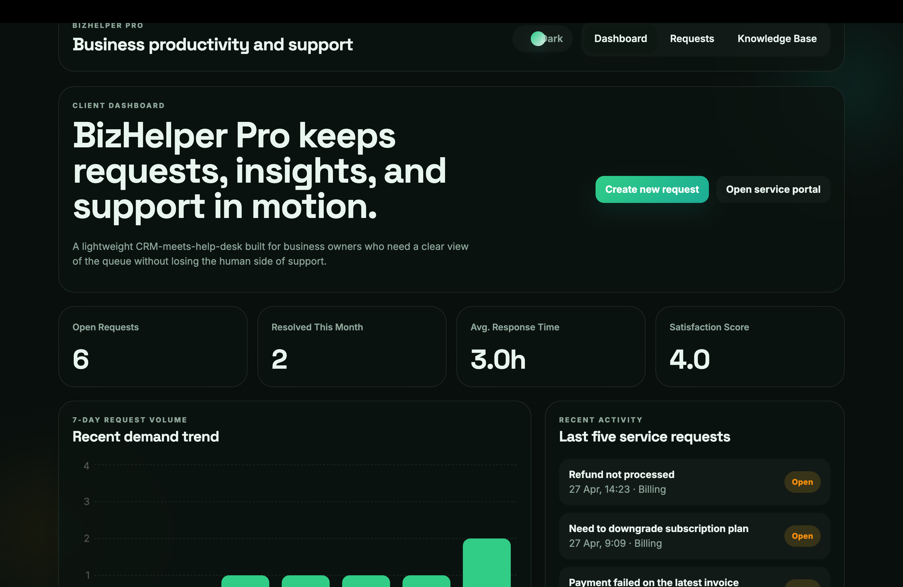
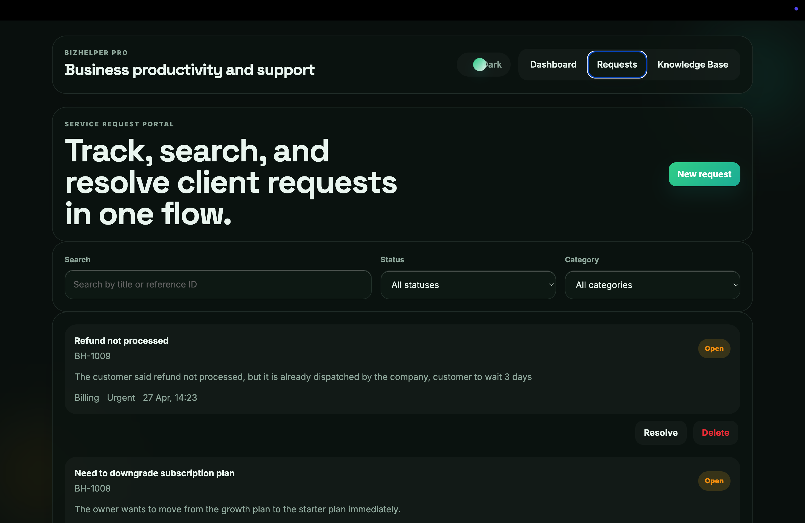
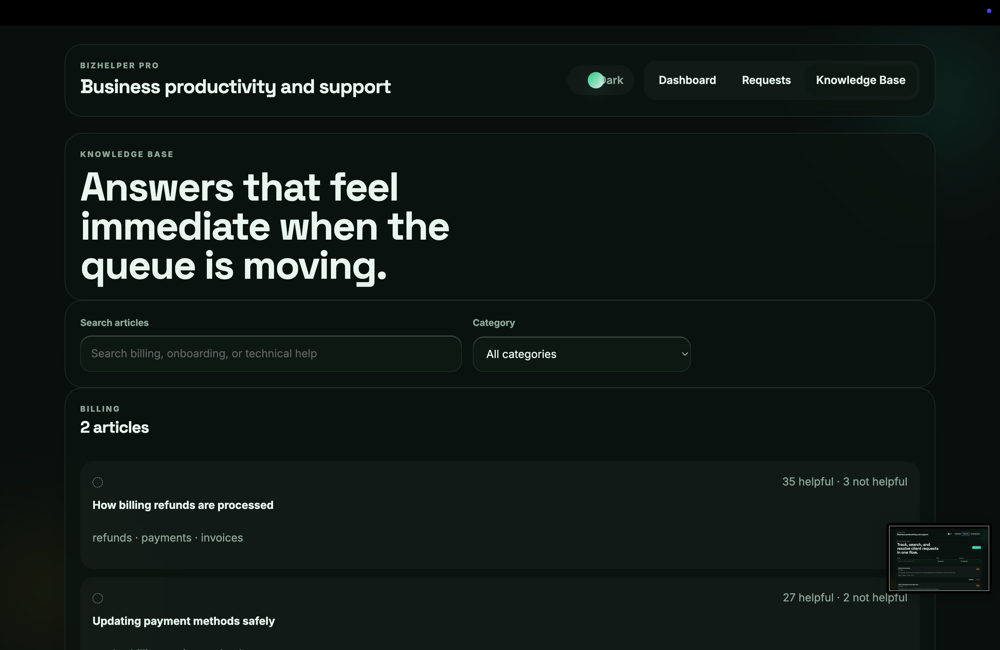

## Screenshots

### Dashboard



### Requests



### Knowledge Base



# BizHelper Pro

BizHelper Pro is split into two standalone apps so each one can be installed and started directly from its own folder.

## Backend

```bash
cd server
npm install
npm start
```

The API runs on `http://localhost:3001`.

## Frontend

```bash
cd client
npm install
npm start
```

The React app runs on `http://localhost:3000`.

## Notes

- The frontend sends the required `X-API-Key: dev-secret-2024` header automatically.
- No extra environment configuration is needed.
- The frontend talks to the live API at `http://localhost:3001/api`.
- Open the browser DevTools network tab to confirm live API calls and the Framer Motion-driven UI behavior.
